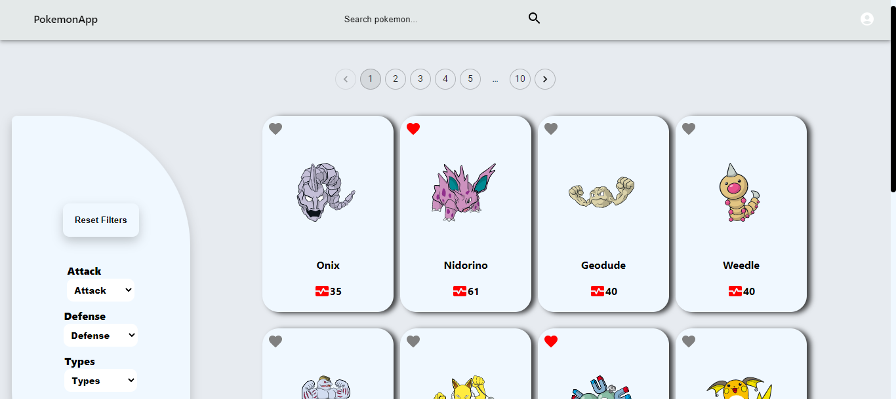
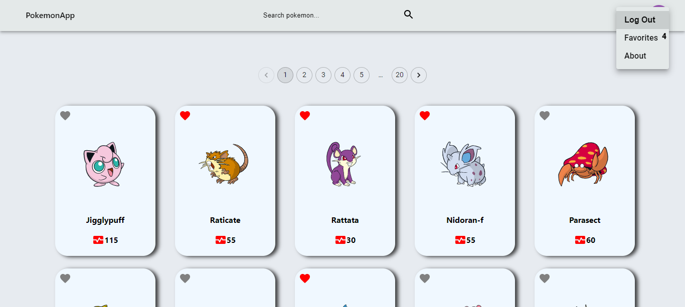
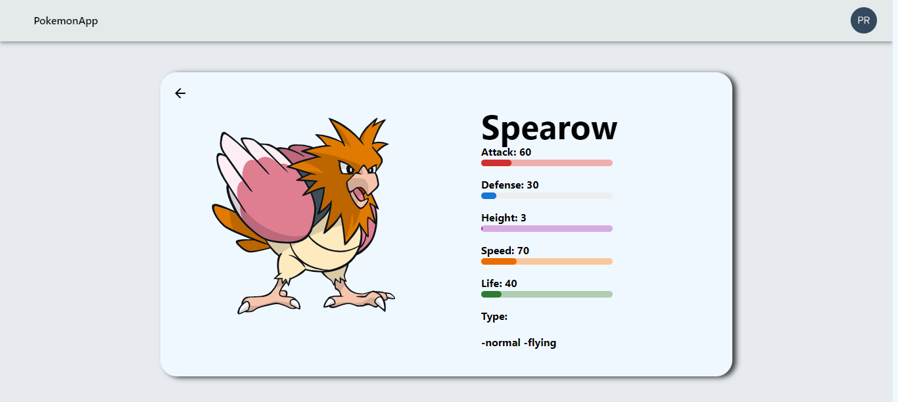
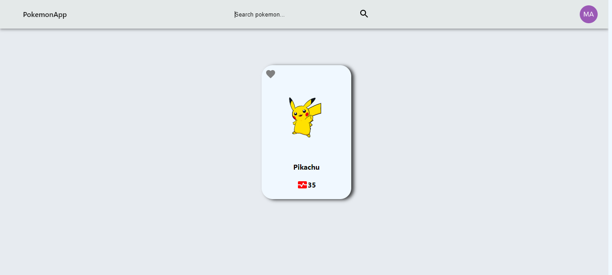
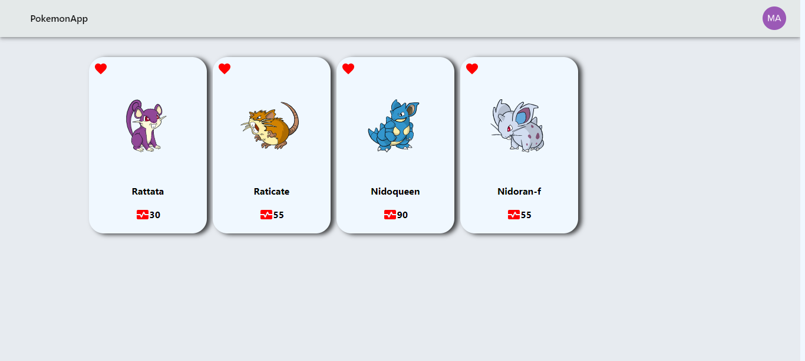
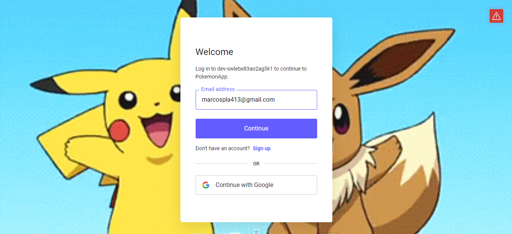

# PokemonApp

Proyecto realizado para practicar tecnologías nuevas y seguir creciendo! Las tecnologias que use fueron: Typescript, React con Vite, Redux Toolkit, Material UI, Styled-Components, PostgreSql, Express y Nodejs.
En la pagina podes agregar a favoritos (Estando o no logueado) y loguearte, si tenias favoritos en la cuenta se van a cargar junto con los nuevos que agregaste.
Podes buscar el Pokemon por nombre. Tambien podes ordenarlos por rango de ataque o defensa y podes filtrar por el distinto tipo que tenga el pokemon.
(La pagina no esta deployada porque en railway no me anda y en render tengo que esperar hasta el mes 4 de 2023 para poder subirlo. Te pido perdon!! yo tambien queria que este en internet)

Pd: Si entras a la foto se ve con mejor calidad!!

## Objetivos del Proyecto

- Construir una App utlizando Typescript, React, Vite, Redux Toolkit, Material UI, Express, Node y Sequelize.
- Aprender y practicar Typescipt, Redux Toolkit y Material UI
- Aprender mejores prácticas.
- Aprender y practicar el workflow de GIT.

Cuenta con dos carpetas: `api` y `client`. En estas carpetas estará el código del back-end y el front-end respectivamente.

La idea general es crear una aplicación en la cual se puedan ver los distintos Pokemon utilizando la api externa [pokeapi](https://pokeapi.co/) guardandolos en la base de datos y a partir de ella poder, entre otras cosas:

- Buscar pokemons (realizado)
- Filtrarlos / Ordenarlos (tengo que hacerlo)
- Crear nuevos pokemons (me falta el formulario)

### Únicos Endpoints/Flags utilice

- GET <https://pokeapi.co/api/v2/pokemon>
- GET <https://pokeapi.co/api/v2/pokemon/{id}>
- GET <https://pokeapi.co/api/v2/type>

## Frontend

Desarrollar una aplicación de React/Redux que contenga las siguientes rutas.

**Ruta principal**: debe contener

- [ ] Input de búsqueda para encontrar pokemons por nombre (La búsqueda será exacta, es decir solo encontrará al pokemon si se coloca el nombre completo si no tira un error)
- [ ] Área donde se verá el listado de pokemons. Al iniciar se mustran 10 pokemons con su:
  - Imagen
  - Nombre
  - Vida
- [ ] Botones/Opciones para filtrar por tipo de pokemon y por pokemon existente o creado por nosotros
- [ ] Botones/Opciones para ordenar tanto ascendentemente como descendentemente los pokemons por orden alfabético y por ataque
- [ ] Paginado para ir buscando y mostrando los siguientes pokemons, 10 pokemons por pagina.

**Ruta de detalle de Pokemon**: debe contener

- [ ] imagen, nombre y tipos
- [ ] Estadísticas (vida, ataque, defensa, velocidad)
- [ ] Altura

**Ruta de creación**: debe contener

- [ ] Un formulario **controlado con JavaScript** con los campos mencionados en el detalle del Pokemon
- [ ] Posibilidad de seleccionar/agregar más de un tipo de Pokemon
- [ ] Botón/Opción para crear un nuevo Pokemon

## Base de datos

El modelo de la base de datos deberá tener las siguientes entidades:

- [ ] Pokemon con las siguientes propiedades:
  - ID (Número de Pokemon) \*
  - Nombre \*
  - Vida
  - Ataque
  - Defensa
  - Velocidad
  - Altura
  - Peso
- [ ] Tipo con las siguientes propiedades:
  - ID
  - Nombre
- [ ] User con las siguientes propiedades:
  - ID
  - Nombre
  - Favoritos

La relación entre Pokemons y Tipos debe ser de muchos a muchos ya que un pokemon puede pertenecer a más de un tipo y, a su vez, un tipo puede incluir a muchos pokemons.

La relacion entre Usuarios y Pokemons es de uno a muchos ya que un usuario puede tener muchos pokemons pero un pokemon puede tener un usuario.

## Backend

Se debe desarrollar un servidor en Node/Express y Typescript con las siguientes rutas:

- [ ] **GET /pokemons**:
  - Obtener un listado de los pokemons desde pokeapi.
  - Debe devolver solo los datos necesarios para la ruta principal
  - Guardarlos en la base de datos
- [ ] **GET /pokemons/{idPokemon}**:
  - Obtener el detalle de un pokemon en particular
  - Debe traer solo los datos pedidos en la ruta de detalle de pokemon
- [ ] **GET /pokemons?name="..."**:
  - Obtener el pokemon que coincida exactamente con el nombre pasado
  - Si no existe ningún pokemon mostrar un mensaje adecuado
- [ ] **POST /pokemons**:
  - Recibe los datos recolectados desde el formulario controlado de la ruta de creación de pokemons por body
  - Crea un pokemon en la base de datos relacionado con sus tipos.
- [ ] **GET /types**:
  - Obtener todos los tipos de pokemons posibles
  - En una primera instancia deberán traerlos desde pokeapi y guardarlos en su propia base de datos y luego ya utilizarlos desde allí

## Imagenes del proyecto

